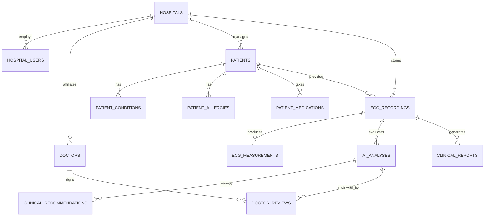

# ECG GUARDIAN — Target System Architecture

**Document Version:** 2.0.0  
**Effective Date:** September 2026  
**System Designation:** Hospital-Oriented ECG Clinical Decision-Support & Multi-Dataset Intelligence Platform  
**Standard Governance:** CDSCO Medical Devices Rules 2017 / IEC 62304 / ISO 14971 / ISO 27799 / HL7 aECG

---

## 1. High-Level Architectural Vision

ECG Guardian transforms standard standalone telemetry software into a multi-tenant, hospital-grade clinical platform integrating autonomous multi-dataset machine learning intelligence with strict clinician-in-the-loop governance.

```text
                                  ECG GUARDIAN
                                       │
        ┌──────────────────────────────┼──────────────────────────────┐
        ↓                              ↓                              ↓
┌──────────────────────┐    ┌──────────────────────┐    ┌──────────────────────┐
│  Hospital Management │    │   Clinical Workflow  │    │   ML Intelligence    │
│  & Multi-Tenancy     │    │   & Ingestion        │    │   & Model Governance │
├──────────────────────┤    ├──────────────────────┤    ├──────────────────────┤
│ • Hospital Registry  │    │ • Multi-Modal Input  │    │ • Dataset System     │
│ • Admin / RBAC       │    │ • Quality Gatekeeper │    │ • Patient Splits     │
│ • Doctor Management  │    │ • ECG Worklist       │    │ • Multi-Task Engines │
│ • Patient Management │    │ • Serial Comparison  │    │ • Model Registry     │
│ • Isolated Schemas   │    │ • Physician Review   │    │ • Model Cards        │
└──────────────────────┘    └──────────────────────┘    └──────────────────────┘
        │                              │                              │
        └──────────────────────────────┼──────────────────────────────┘
                                       ↓
                        ┌──────────────────────────────┐
                        │  Clinical Decision Support   │
                        │  & Medication Safety Engine  │
                        ├──────────────────────────────┤
                        │ • Evidence Generation        │
                        │ • Clinical Guidelines (ACC)  │
                        │ • Contraindication Checks    │
                        │ • Drug-Drug Interaction      │
                        │ • Zero Autonomous Rx Gate    │
                        └──────────────────────────────┘
                                       │
                        ┌──────────────┴──────────────┐
                        ↓                             ↓
            ┌──────────────────────┐      ┌──────────────────────┐
            │    PATIENT REPORT    │      │    DOCTOR REPORT     │
            ├──────────────────────┤      ├──────────────────────┤
            │ • Plain language     │      │ • Technical findings │
            │ • Patient-friendly   │      │ • AI vs Machine comp │
            │ • Quality status     │      │ • Electrophysiology  │
            │ • Discussion points  │      │ • Decision evidence  │
            │ • Safety guidance    │      │ • CDS considerations │
            │ • Doctor-signed plan │      │ • Clinician sign-off │
            └──────────────────────┘      └──────────────────────┘
```

---

## 2. Core Architectural Pillars

### 2.1 Multi-Tenant Hospital Isolation
- Every database record contains a non-nullable `hospital_id`.
- Tenant boundary enforcement ensures Hospital A's administrators, clinicians, and patients can never access Hospital B's data under any circumstance.
- Role-Based Access Control (RBAC) supports:
  - `HOSPITAL_ADMIN`
  - `CARDIOLOGIST`
  - `DOCTOR`
  - `ECG_TECHNICIAN`
  - `NURSE`
  - `RESEARCHER`
  - `PATIENT`

### 2.2 Autonomous Multi-Dataset Machine Learning System
Rather than relying on one monolithic model, ECG Guardian deploys task-specific, specialized models:
1. **Signal Quality Model (`TASK_QUALITY_GATE`)**: Deterministic technical quality gatekeeper assessing lead integrity, SNR, clipping, baseline drift, and powerline interference.
2. **Beat Arrhythmia Model (`TASK_BEAT_ARRHYTHMIA`)**: Single-lead rhythm beat classification (Normal, PVC, SVEB, Other) trained on patient-isolated MIT-BIH recordings.
3. **Atrial Fibrillation Model (`TASK_AF_DETECTION`)**: Rhythm strip episode classifier distinguishing AFib from non-AFib rhythms (MIT-BIH AF Database).
4. **12-Lead Diagnostic Model (`TASK_12LEAD_DIAGNOSTIC`)**: Multi-label classification across standard 12 leads for major clinical superclasses: NORM, MI, STTC, CD, HYP (PTB-XL).
5. **ST/T Segment Analysis Model (`TASK_ST_ANALYSIS`)**: Ischemia and repolarization analysis (European ST-T / MIT-BIH ST Change Database).

### 2.3 Strict Clinical Safety & Zero-Fabrication Gates
1. **Zero Data Fabrication**: If an ECG parameter, patient allergy, condition, or medication is unavailable or unmeasurable, it is strictly reported as `UNKNOWN` or `NOT RELIABLY MEASURABLE`. No data is ever synthesized.
2. **Zero Autonomous Prescriptions**: The platform evaluates drug-drug interactions, contraindications, and clinical considerations, but **never writes an autonomous prescription**. Therapeutic decisions require explicit clinician authorization.
3. **Model Output Probability vs. Diagnostic Confidence**: Confidence displays are replaced with explicit algorithmic probabilities (e.g. `Model output probability: 0.98`) alongside statements explaining that probability is not equivalent to clinical certainty.
4. **Separation of Source Machine Interpretation vs. AI**: Source document printed measurements are preserved separately from AI model predictions and compared explicitly (`AGREE`, `MINOR_DIFFERENCE`, `SIGNIFICANT_DISAGREEMENT`).

---

## 3. Data Flow & Execution Pipeline

```text
1. Ingestion:
   Upload File (PDF / Image / CSV / TXT / NPY / WFDB / EDF)
        ↓
2. Modality & Signal Verification:
   MIME / Format Sniffing -> Trace Extraction / Digital Parsing
        ↓
3. Quality Gatekeeper:
   SNR, Clipping, Drift, Powerline -> Return GOOD / ACCEPTABLE / POOR / UNUSABLE
   (If UNUSABLE: Halts AI with explicit technical failure reason)
        ↓
4. Electrophysiological Measurements:
   HR, RR, PR, QRS, QT/QTc, Electrical Axes (Deterministic Algorithms)
        ↓
5. Model Compatibility & Inference:
   Inspect leads & sampling rate -> Select compatible specialized model -> Calculate probabilities
        ↓
6. Evidence Extraction & Machine Comparison:
   Isolate beat morphology -> Compare AI prediction with printed machine interpretation
        ↓
7. Longitudinal Timeline:
   Retrieve prior ECG records for patient -> Compute delta in intervals & rhythm shifts
        ↓
8. Clinical Decision Support & Medication Safety:
   Correlate ECG findings + Patient profile (Allergies, Conditions, Meds) + Guidelines
   -> Produce Clinical Considerations & Medication Safety Alerts (No autonomous Rx)
        ↓
9. Doctor Review & Sign-Off:
   Clinician inspects findings -> Accepts/Modifies diagnosis -> Enters treatment plan -> Cryptographically signs
        ↓
10. Dual Report Generation:
    Patient-Friendly Report (Simple language) + Doctor Technical Report (Clinical detail)
        ↓
11. Cryptographic Audit Ledger:
    SHA-256 hash-chained event appended to audit trail
```

---

## 4. Multi-Tenant Relational Schema Design



---

## 5. Architectural Quality Attributes

| Attribute | Specification | Verification Mechanism |
| :--- | :--- | :--- |
| **Data Isolation** | Multi-tenant filtering on `hospital_id` in every SQL query | Integration tests verifying cross-tenant access rejection |
| **Auditability** | SHA-256 hash-chained append-only ledger for all clinical actions | Tamper-detection test suite in `tests/test_db_and_audit.py` |
| **Reproducibility** | Deterministic seeds, fixed patient splits, versioned preprocessors | Model card registry and automated split validation |
| **Safety** | Technical failure halts, zero autonomous prescribing barrier | Automated safety gate assertions and unit tests |
| **Transparency** | Plain language for patients, electrophysiology terminology for doctors | Dual template generators for Patient vs. Doctor reports |
